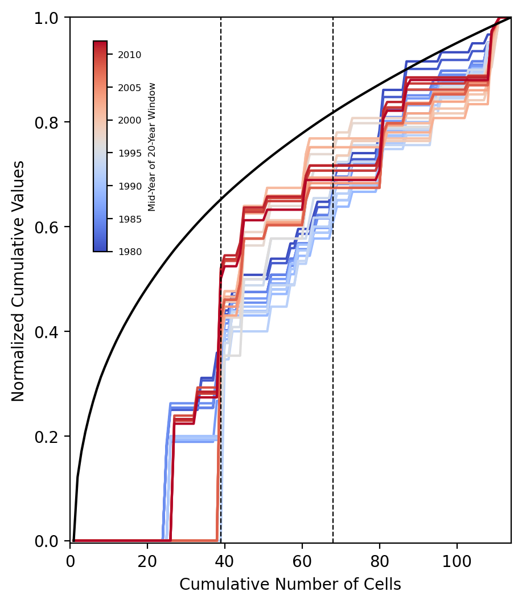

# Correlation Analysis of Strain Rates and Seismicity

This analysis helps identify regions where disastrous earthquakes may occur in future. It demonstrates advanced geospatial data analysis by correlating strain rates (*an indicator for stress accumulation within the Earth leading to earthquakes*) with seismicity patterns to reveal insights into the tectonic behaviour of the Sagaing fault in Myanmar. It incorporates cutting-edge geospatial libraries and statistical methodologies to process and visualize data.

## Impact
This project provides a robust framework for geoscientists and data scientists to analyze strain rate-seismicity relationships, aiding in tectonic studies, seismic hazard assessment, and infrastructure planning in earthquake-prone regions.

## Key Features
- **Data Integration**: Analyzed strain rate data (NetCDF format) and seismic event catalogs (CSV format) using Python libraries such as `netCDF4`, `Pandas`, and `Geopandas`.
- **Advanced Visualization**: Created insightful visualizations with `Cartopy` and `Matplotlib`, including spatial overlays of seismicity and strain rates.
- **Fault Analysis**: Processed and segmented fault line data to study active tectonic features, focusing on the Sagaing Fault system.
- **Geospatial Interpolation**: Utilized `Scipy`'s `griddata` and Gaussian smoothing to interpolate and refine strain rate data.
- **Dynamic Mapping**: Exported geospatial data in KML format for interactive exploration in GIS tools.

## Technologies Used
- **Programming Languages**: Python
- **Libraries**: `netCDF4`, `Pandas`, `Geopandas`, `Cartopy`, `Scipy`, `Matplotlib`
- **Data Formats**: NetCDF, CSV, Shapefiles, KML
- **Geospatial Tools**: Fault segmentation, strain rate interpolation, and seismicity overlay
  
----------------

## Figures

**Figure 1**: Map of the study area

This map visualizes historical earthquakes and tectonic features in Myanmar, highlighting seismicity along the Sagaing Fault. Red stars mark major earthquakes (M > 7.0), while orange circles represent shallow seismicity (M > 4.0). Focal mechanisms (beachballs) indicate faulting styles, and black lines delineate geological faults, with bold lines emphasizing the Sagaing Fault system. Key geospatial layers include SRTM topography, GPS station locations (blue triangles), and urban centers (cyan squares). The dashed box outlines the study area, integrating seismic, tectonic, and geospatial insights for hazard assessment.

--------

**Figure 2**: Spatial Correlation of Maximum Shear Strain and Earthquake Distribution Along the Sagaing Fault

This visualization demonstrates the spatial relationship between tectonic strain and seismicity, providing insights into fault activity and seismic hazard zones. It combines strain modeling and earthquake data for geospatial analysis in hazard assessment.

------------

**Figure 3**: Temporal Evolution of Strain rates and Seismicity Distribution Along the Sagaing Fault, Myanmar

This plot highlights how strain rates (black curve) and seismicity accumulate across grid cells over time and identifies temporal shifts in their spatial distribution, offering insights into evolving seismic hazard patterns along the Sagaing Fault.

